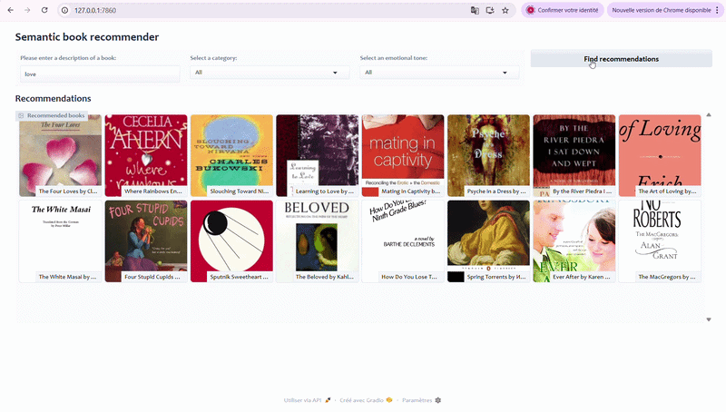

# Semantic Book Recommender

A content-based recommendation system that takes a plain English query 
and returns semantically relevant books from a dataset of 5,200+ titles. 
Built using vector search, zero-shot classification, and sentence-level 
emotion extraction.

---

## Demo

Click on the image below to watch the demo:

[](https://drive.google.com/drive/folders/1orAXfGfcJaH4Xtu62jU-vyDcyT8uRTUo)

## What it does

- Takes a natural language description of the book you are looking for
- Retrieves the most semantically similar books via vector search
- Filters results by genre: Fiction, Non-Fiction, Children's Fiction, 
  Children's Non-Fiction
- Sorts results by emotional tone: Happy, Surprising, Angry, 
  Suspenseful, Sad
- Displays results in an interactive Gradio dashboard with cover images

---

## Architecture

The system is built in four stages:

**1. Data cleaning**
Raw data from the 7K Books Kaggle dataset. Descriptions under 25 words 
are dropped, books with missing metadata are removed — leaving 5,200 
usable titles. Each description is prepended with its ISBN13 as a 
unique identifier for efficient retrieval.

**2. Vector search**
Each description is embedded using OpenAI's Ada model and stored in a 
ChromaDB vector database via LangChain. At query time, the input is 
embedded using the same model and the database returns the closest 
matches by cosine similarity.

**3. Genre classification**
Zero-shot classification using `facebook/bart-large-mnli` — no labelled 
training data required. Achieves ~78% accuracy across four genre 
categories: Fiction, Non-Fiction, Children's Fiction, Children's 
Non-Fiction.

**4. Emotion extraction**
Each description is split into individual sentences and passed through 
`j-hartmann/emotion-english-distilroberta-base`, a fine-tuned RoBERTa 
model. The maximum score per emotion across all sentences is retained 
per book, covering: anger, disgust, fear, joy, sadness, surprise, 
neutral. Sentence-level analysis captures mixed emotional tones more 
accurately than description-level classification.

---

## Stack

| Package | Purpose |
|---|---|
| `langchain` + `langchain-openai` + `langchain-chroma` | Embeddings pipeline and vector database |
| `transformers` | Zero-shot classification and emotion extraction |
| `gradio` | Interactive dashboard |
| `pandas` / `numpy` | Data processing |
| `python-dotenv` | API key management |
| `kagglehub` | Dataset download |

---

## Getting started

Python 3.11+ and an OpenAI API key required.

```bash
git clone https://github.com/Abir-H26/Book-recommender-using-LLM
cd Book-recommender-using-LLM
python -m venv .venv
source .venv/bin/activate
pip install -r requirements.txt
```

Create a `.env` file:

```env
OPENAI_API_KEY=your_openai_api_key_here
```

Download the dataset:

```python
import kagglehub
path = kagglehub.dataset_download("dylanjcastillo/7k-books-with-metadata")
```

Run notebooks in order:
data-exploration.ipynb
vector-search.ipynb
text-classification.ipynb
sentiment-analysis.ipynb

Launch the dashboard:

```bash
python gradio-dashboard.py
```

Opens at `http://127.0.0.1:7860`

---

*Built following the LLM course by Dr. Jodie Burchell (JetBrains / 
freeCodeCamp)*
